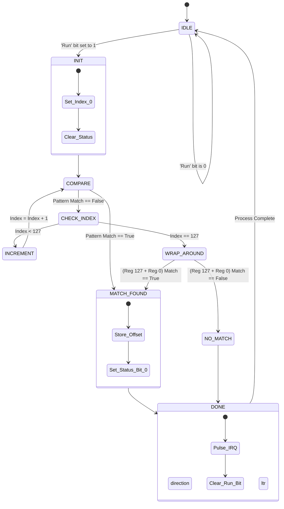

```mermaid
stateDiagram-v2
    [*] --> IDLE
    
    IDLE --> INIT : 'Run' bit set to 1
    IDLE --> IDLE : 'Run' bit is 0
    
    state INIT {
        direction ltr
        [*] --> Set_Index_0
        Set_Index_0 --> Clear_Status
    }
    
    INIT --> COMPARE
    
    COMPARE --> MATCH_FOUND : Pattern Match == True
    COMPARE --> CHECK_INDEX : Pattern Match == False
    
    CHECK_INDEX --> INCREMENT : Index < 127
    CHECK_INDEX --> WRAP_AROUND : Index == 127
    
    INCREMENT --> COMPARE : Index = Index + 1
    
    WRAP_AROUND --> MATCH_FOUND : (Reg 127 + Reg 0) Match == True
    WRAP_AROUND --> NO_MATCH : (Reg 127 + Reg 0) Match == False
    
    state MATCH_FOUND {
        direction ltr
        [*] --> Store_Offset
        Store_Offset --> Set_Status_Bit_0
    }
    
    MATCH_FOUND --> DONE
    NO_MATCH --> DONE
    
    state DONE {
        direction ltr
        [*] --> Pulse_IRQ
        Pulse_IRQ --> Clear_Run_Bit
    }
    
    DONE --> IDLE : Process Complete
```